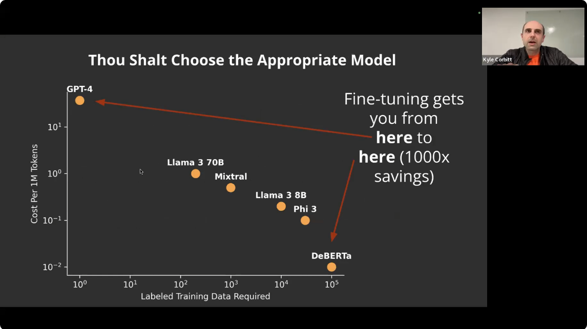
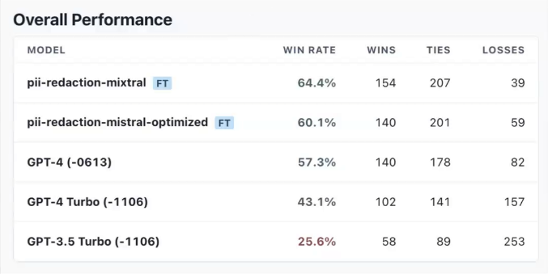

# From prompt to model: fine tuning when you've already deployed LLMs in prod (with Kyle Corbitt)

Speaker introduces the topic surveying participants on whether they use LLMs in production, how many LLM calls they made, etc...
Not many have deployed LLMs in production (83% vs 17% that have).

Corbitt's slides title is "Ten commandments"

## 1. Thou Shalt Not Fine-Tune

* just use prompting
* optionally, few shot examples in the prompt or from RAG
* ... unless you can't hit your 1. quality, 2. latency or 3. cost target

Using a smaller model can save a lot of costs, and still provide a good enough performance.

## 2. Thou Shalt Write a Prompt

* Create a model performance baseline (go through evals, f.ex.)
* Prove the task is possible. Using f.ex. ChatGPT and prompting only, you can establish whether the task is even possible

If the task works with prompting a big model:  ~90% chance that fine-tuning will make it better.
If it doesn't work with prompting a big model: ~25% chance that fine-tuning will work at all.

Essentially, your "playbook" is:

* start with GPT-4 and prompting (0 -> 1)
* scale up fine-tuning (1 -> 100)

## 3. Thou Shalt Review Thy Data

Looking in detail at the data you have available (training data, results) is going to be the most useful part of project.
With that information, you can refine your tests, your evals, the data itself, etc...

Suggestion to use [Open Pipe](https://openpipe.ai/) to review/relabel your data.

> Spin up a relabeling UI, there's several good ones

*ok, which ones? Was it openpipe?*

Even if the data has some bad training samples, that may be still ok. It's not guaranteed to produce bad results when fine-tuning.
It's important though to "make sure the dataset is correct on average".

## 4. Thou Shalt Reserve a Test Set

Reserve part of the training set as test (a bit obvious...).
Try to make that test set as representative of the whole training set as possible.
In Corbitt's experience, many people don't do this properly.

## 5. Thou Shalt Choose an Appropriate Model

Fine-tuning gets you ~1000x savings compared to GPT-4.

He also mentions that 7B, 8B models are the sweet spot for best results with fine-tuning. *Although it must also depend on the downstream task for the most part?*

*(there was no sixth commandment)*

## 7. Thou Shalt Write Fast Evals

Fast evaluations are critical to speed up the iteration cycle.
*Could be python test suites, like Hamel showed in previous workshops?*

Can either be run as part of the training loop, or when changing the prompt.

Suggests to start with the ["LLMs as judge"](https://huggingface.co/learn/cookbook/llm_judge) approach as another quick way to perform relatively fast evaluations of a prompt or a model.

## 8. Also, Thou Shalt Write Slow Evals

It's important to complement fast evaluations with more thorough slow evaluation cycle, to catch any drifts early, and to perform a more complete assessment of model performance. There's lots of reasons why fast evals won't give you the full picture. Model quantization is one reason that was mentioned.

*What is meant by a slow evaluation though*?

He called them "outer loop evaluations", or "production model evaluations".

## 9. Thou Shalt Not Fire and Forget

Over time it's likely that your model is not going to be performing as well as when it was deployed, due to many reasons, but essentially "data drift".

Example: all training samples for payment dates were from 2023, when 2024 rolled around, the system kept predicting dates with 2023. Keep re-training and fine-tuning your model every now and then.

*(no tenth commandment either)*

## Links

* https://openpipe.ai/
* https://huggingface.co/learn/cookbook/llm_judge
